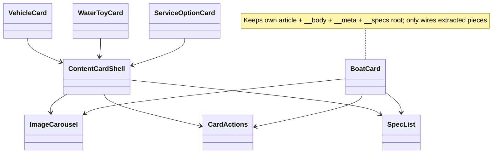

# Software Design Document: Robust Content System for FastService (Fallback Unification, Deduplication, and Debt Cleanup)

**Author:** Grok (systems architect, delegated subagent)  
**Date:** 2026-06-03  
**Status:** Draft  
**Project:** FastService (Ibiza luxury lifestyle management site) at `C:\Users\Maxim\OneDrive\Escritorio\Proyectos\lacocinadepedro\FastService`  
**Related:** Next.js 16 App Router + Turbopack, React 19, Supabase SSR/JS (remote project `srmdwudjynqovzoejcay.supabase.co`), custom jsonb CMS via `content_items`, custom i18n.

---

## Overview

The FastService site relies on a hybrid content model: rich localized seeds in `data/*.ts` (boats, collections, vehicles, water toys, services, faqs, posts) power an admin "initial" snapshot, while Supabase `content_items` (with `payload jsonb`, `status=published`, RLS via `app_private.is_admin()`) is intended as the runtime source of truth for published content. Public pages (`app/(site)/[locale]/page.tsx`, dynamic boat/service routes, sitemap, not-found, layouts) consume via `getPublicContent()` → `loadPublicContentSnapshot()` (React `cache()` wrapped) → `loadRows(false)` in `lib/supabase/content.ts`.

Exploration revealed the public path **never falls back to local seeds**, directly contradicting `README.md:28`. When `!hasSupabaseConfig()` (line 121), on query error (line 136), or `!data?.length` (starting at line 139, block spans 139-146), it returns `createEmptyContentSnapshot()` (all arrays `[]`) with messages like "Supabase no esta configurado; sin fallback local." or "Supabase esta vacio; sin fallback local publicado.". Result: home sections, cards, and detail pages render nothing for core content. Admin (`lib/admin/snapshot.ts:211` `createInitialAdminSnapshot()`) *does* import+normalize `data/*` but the function is never invoked by loaders or the running admin UI (which receives empty from `loadAdminContentSnapshot()`). (Grep across `*.{ts,tsx}` confirmed the create fn has only its definition + type imports of normalize*; no runtime calls to createInitial outside its own module.)

Additional issues include data source fragmentation (e.g. `lib/routes.ts`, `data/navigation.ts` (partial), `app/(site)/[locale]/layout.tsx` (posts), menus, and `lib/content.ts` path builders mix live snapshot with static seeds), card UI duplication across `components/boats/BoatCard.tsx`, `vehicles/VehicleCard.tsx`, `water-toys/WaterToyCard.tsx`, `services/ServiceOptionCard.tsx` (despite partial sharing in `components/cards/CardActions.tsx`), repeated full-snapshot fetches in every `get*BySlug`/`getAll*Paths` helper, hardcoded bilingual title, and stale prior artifacts.

This SDD proposes **application-layer only fixes** (no schema/policy changes to `supabase/schema.sql` or related) to:
- Unify fallback so public + admin always receive usable content (prefer Supabase published rows when present; seeded local otherwise).
- Eliminate fragmentation by pruning direct `data/*` usage in public paths and making overrides consistent.
- Deduplicate card primitives while preserving exact visuals and per-item `whatsappMessage` behavior.
- Reduce access boilerplate and polish debt.
- Ensure incremental, safe rollout for live Supabase-backed deployments (populated tables unaffected).

All changes respect the locked Supabase skill (`app/.agents/skills/supabase/SKILL.md` v0.1.2 and skills-lock.json): changelog verified via fetch (no breaking changes impact our query/upsert/auth/storage-signed patterns); no migrations, no `apply_migration`, no new RLS/views/functions; Security Checklist items (e.g., no `user_metadata` authz, Storage INSERT+SELECT+UPDATE already present for existing bucket) untouched.

---

## Background & Motivation

**Current state (verified via direct file reads):**
- Public consumption always goes through `lib/content.ts:getPublicContent()` (delegates to cached `loadPublicContentSnapshot`) then finder functions (`getBoatBySlug:38`, `getVehicleBySlug:66`, `getAllBoatPaths:123`, `getPageBySlug`, `getItemBySectionAndSlug`, `getAllLocalized*`, `buildAlternates` etc.). Each re-calls the loader.
- `lib/supabase/content.ts:118` (`loadRows`):
  ```ts
  if (!hasSupabaseConfig()) {
    return { snapshot: unavailableFallback /* empty */, source: "static", message: "Supabase no esta configurado; sin fallback local." };
  }
  ...
  if (!data?.length) {
    return { snapshot: unavailableFallback, source: "supabase", message: selectAll ? "Supabase esta vacio; no se cargan seeds locales automaticamente." : "Supabase esta vacio; sin fallback local publicado." };
  }
  return { snapshot: snapshotFromRows(data..., createEmptyContentSnapshot()), source: "supabase" };
  ```
  `snapshotFromRows:89` only normalizes when rows exist; `createEmptyContentSnapshot:73` is the universal fallback. (Note: error return is at line 136; `!data?.length` check begins at line 139 with the if-block spanning ~139-146.)
- Admin path (`app/admin/page.tsx:14`, `loadAdminContentSnapshot`) and `saveAdminSnapshotToSupabase:161` (which *does* call `normalizeAdminContentSnapshot`) use the same loader. `createInitialAdminSnapshot:211` (imports `boatCollections` etc from `@/data/*`, applies `normalize*` for slugs, richDescription fallbacks, amenities merge, marina defaults, security/self-drive options, category slug resolution) is **dead for runtime** (grep across `*.{ts,tsx}` found only its definition + type imports).
- `README.md:28` explicitly promises local fallback for "no config or fails". Bootstrap checklist assumes site works from seeds until first save. Reality: new deploys or missing envs show blank sections (BoatCollectionSection, FeaturedBoatsSection, TransferSection etc. in `app/(site)/[locale]/page.tsx:37`).
- Fragmentation examples: `lib/routes.ts:1-4` (always `import { vehicles } from "@/data/vehicles"` etc for `getVehiclePath`); `data/navigation.ts` (has `NavigationContent` override support but seeds as default); `components/layout/*` + `lib/content.ts:93` (posts always from `data/posts`); `lib/language-routing.ts` and `lib/content.ts:16` duplicate `matchesLocalizedSlug` / `normalizeSlugSegment` / collection lookup logic.
- Cards: BoatCard implements its own WA + detail buttons, spec formatting/icons, labels (lines 77-86). Others delegate to shared `CardActions` (which does `buildWhatsAppUrl` + two links) + `ImageCarousel` + `NoWidowText`. Visuals differ by BEM class (`.boat-card__*` vs `.catalog-card-actions`, `.vehicle-card` etc.) and domain data (Boat has `priceLabel` + 4 specs with icons; others have overview + 0-3 mini-specs + availability pill).
- Other debt: `app/(site)/[locale]/page.tsx:16` (`title: locale === "es" ? "Ibiza Lifestyle Management" : "Ibiza Lifestyle Management"` — identical); mixed `bun.lock` + `package-lock.json`; root artifacts (`codex-next-*.log`, `test-results/`); custom i18n spread across `lib/i18n.ts`, `language-routing.ts`, `content.ts`, `routes.ts`.
- Supabase constraints (non-negotiable): remote only (no local `supabase` CLI visible); manual SQL Editor execution; `content_items` GIN + indexes + RLS "public can read published" + admin full via `is_admin()` (in `app_private`); Storage bucket policies grant admin CRUD; `next.config.ts` already dynamically adds Supabase hostname(s) for images + unsplash.

**Verification performed (via tools before authoring):** Full directory listings of root + subdirs; 30+ targeted `read_file` (full + offset/limit on cited files including lib/supabase/content.ts entire, lib/admin/snapshot.ts entire, cards, pages, schema.sql, skill md, PDF as text); 20+ `grep` runs with globs (e.g. data/ imports, createInitialAdminSnapshot, getPublicContent sites, card patterns); `web_fetch` of https://supabase.com/changelog.md (scanned for breaking-change tags affecting ssr/js clients, auth, storage, RLS); run_terminal_command for fs state. All claims cross-checked against actual code (see also writer summary).

**Pain points quantified (from exploration):**
- 0 boat/collection/vehicle/water-toy/service items rendered on home if no live Supabase rows or config (affects all locales, all generateStaticParams for boats/items).
- At least 4 near-identical card implementations (~150-200 LOC duplicated logic for media + actions + i18n).
- 12+ async re-fetches of full snapshot per request in finders (harmless due to `cache()` but verbose and error-prone for maps).
- Admin "seed local" message shown but snapshot empty → users must manually recreate from `data/*.ts` (or copy-paste) for new projects.
- Path builders can diverge (static seed slugs vs. edited `slugsByLocale` in payload after admin save).

Motivation: make the site *reliably* functional (public + admin) with or without Supabase, complete the "migration" to snapshot as single source without breaking existing published sites, reduce maintenance surface, and follow "verify first" Supabase discipline.

---

## Goals & Non-Goals

**Goals:**
- Public pages and admin always receive non-empty content for core types when Supabase provides no rows (or is unconfigured/errored). Site "just works" for local dev, new projects, and fallbacks. (Highest priority.)
- Seeded local data is the *default* base; Supabase published rows (per `content_type`) override when present. `snapshotFromRows` + `normalizeAdminContentSnapshot` applied consistently.
- Eliminate direct `data/*` imports from public runtime paths (cards, routes) except where explicitly for seeds or navigation override pattern. Keep seeds authoritative only via `createInitialAdminSnapshot`.
- Reduce card duplication: share WhatsApp + detail action logic, media, and spec rendering primitives (preserve per-domain classnames, labels, `whatsappMessage` construction, and Boat-specific price/meta).
- Centralize repeated access: snapshot load + slug matching + path building with fewer call sites and less duplication between `lib/content.ts`, `language-routing.ts`, `i18n.ts`.
- Fix polish (locale-aware home title, dead code, doc/code alignment). Document Supabase skill compliance.
- Incremental rollout: changes are safe for live sites (populated `content_items` unaffected; `revalidate` paths preserved). PRs independently reviewable/mergeable.
- Quantify: content snapshot small (<100 items total across keys; jsonb payloads < tens of KB including rich html + 5-10 MediaAssets per item). Fallback adds negligible bundle (seeds already imported for admin). Latency: no change (still cached, static when fallback).

**Non-Goals:**
- No changes to `supabase/schema.sql`, RLS policies, storage policies, `admin_users`, triggers, or any `.sql` files. (If ever needed later: *mandatory* pre-steps = fetch changelog + `supabase db advisors`, use `execute_sql` or Editor + `supabase db pull <name> --local --yes`, verify queries, Security Checklist, never `apply_migration` or `user_metadata`.)
- No migration of posts, navigation, or blog into `content_items` (stay static for now; faqs already in CMS).
- No new schema fields, tombstone rows for "explicit empty", or bidirectional sync UI.
- No full rewrite of sections or i18n (consolidate only the worst duplication).
- No new tests, feature flags, or observability dashboards (propose lightweight logging only).
- No image migration (unsplash → Storage) or bundle size work beyond what's needed for seeds.
- Do not alter existing visuals, WhatsApp prefill behavior ("Rodrigo"), or per-locale slug semantics.

---

## Proposed Design

### Content Loading Unification (Core Fix)

Introduce a single source for seeded content and adjust `loadRows` to prefer it on absence.

**Add to `lib/admin/snapshot.ts` (or expose existing):**
```ts
export function createSeededContentSnapshot(): AdminContentSnapshot {
  return createInitialAdminSnapshot(); // already does normalize + seeds
}
```

(Keep `createInitialAdminSnapshot` for backward/ admin "reset" button if added later.)

**Update `lib/supabase/content.ts` (primary change):**
```ts
import { createInitialAdminSnapshot, normalizeAdminContentSnapshot, ... } from "@/lib/admin/snapshot";
// ...
function getLocalSeededSnapshot(): AdminContentSnapshot {
  return createInitialAdminSnapshot();
}

async function loadRows(selectAll: boolean): Promise<ContentSnapshotResult> {
  const localSeeded = getLocalSeededSnapshot();

  if (!hasSupabaseConfig()) {
    return { snapshot: localSeeded, source: "static", message: "Supabase no esta configurado; usando seeds locales." };
  }

  try {
    const supabase = await createSupabaseServerClient();
    let query = supabase.from("content_items").select("content_type,content_id,payload,sort_order").order("content_type").order("sort_order");
    if (!selectAll) query = query.eq("status", "published");

    const { data, error } = await query;
    if (error) {
      return { snapshot: localSeeded, source: "static", message: `Supabase no pudo leer: ${getSupabaseErrorText(error)}; fallback local.` };
    }

    if (!data?.length) {
      return {
        snapshot: localSeeded,
        source: "static",
        message: "Supabase vacio; usando seeds locales (publicados en admin y guardados para persistir)."
      };
    }

    // When rows exist, use empty base so absent keys become [] (supports intentional clear of a type)
    return { snapshot: snapshotFromRows(data as ContentRow[], createEmptyContentSnapshot()), source: "supabase" };
  } catch (error) {
    return { snapshot: localSeeded, source: "static", message: error instanceof Error ? error.message : "Fallback local por error." };
  }
}
```

- `snapshotFromRows` (unchanged core logic) + its internal `normalizeAdminContentSnapshot` call ensures published payloads get slug normalization, forced published/listed, richDescription fallbacks, etc.
- Per-key override semantics: any `content_type` with >=1 row in DB uses exactly those (after sort); types with 0 rows get `[]` when any other data present. Full empty table → full local seeds.
- `loadPublicContentSnapshot` and `loadAdminContentSnapshot` unchanged (still cached for public).
- `getPublicContent()` unchanged (returns `.content`).
- `saveAdminSnapshotToSupabase` already normalizes before per-key upsert/delete. Saving a full admin snapshot (populated from seeds) will create rows for *all* keys.

**Mermaid: Current vs. Proposed Flow**

```mermaid
flowchart TD
    subgraph Current
        P1[Page / generateStaticParams / sitemap] --> GP[getPublicContent]
        GP --> LPS[loadPublicContentSnapshot cache]
        LPS --> LR[loadRows false]
        LR -->|!hasConfig| E1[createEmpty]
        LR -->|query error| E2[createEmpty]
        LR -->|!data.length| E3[createEmpty + 'sin fallback local']
        LR -->|rows| SFR[snapshotFromRows empty] --> N[normalize] --> C[content]
    end

    subgraph Proposed
        P2[...] --> GP2[getPublicContent]
        GP2 --> LPS2[cache]
        LPS2 --> LR2[loadRows]
        LR2 -->|!has / error / !length| LS[getLocalSeeded = createInitialAdminSnapshot normalized] --> C2[content with seeds]
        LR2 -->|rows exist| SFR2[snapshotFromRows with EMPTY base] --> N2[normalize only present keys] --> C3[supabase overrides; absent keys=[]]
        Note[Admin loadAdmin uses same; starts populated when empty DB]
    end
```

**Admin integration:** `app/admin/page.tsx` + `AdminDashboard` receive real seeded snapshot + updated message ("Seed local cargado. Guarda en Supabase..."). Existing "Cargar" flows / add / duplicate continue to work. Optional future: add "Reset to seeds" button that does `setSnapshot(createSeeded...)` (in-memory until save).

**Update call sites that surface source/message** (minimal): `getInitialSaveStatus` in dashboard already handles "static" nicely; tweak strings for accuracy.

**Impact on static generation:** `generateStaticParams` (boat, item, slug pages) + sitemap now succeed with seeds even without `NEXT_PUBLIC_SUPABASE_*` at build. `revalidate = 60` preserved.

Note on generator signatures (addressing sloppy async handling): Current implementations (e.g. `app/(site)/[locale]/boat/[categorySlug]/[boatSlug]/page.tsx:20`, `[slug]/page.tsx:22`, `[slug]/[itemSlug]/page.tsx:14`) do `export function generateStaticParams() { return getAll*Paths(); }` where the helpers are async (they await `getPublicContent()`). Next.js internally awaits the returned thenable, so it works today and with the fallback fix (seeds ensure non-empty paths). However, this is not best practice and can confuse static analysis/linters. In PR4 (or as a drive-by when touching `lib/content.ts` in PR1), change to `export async function generateStaticParams() { return await getAllBoatPaths(); }` (and similarly for others) for clarity. No functional change.

Build-time snapshot vs. runtime published divergence for SSG: `generateStaticParams` and sitemap reflect the snapshot state (Supabase published rows or seeds) at *build time*. 
- Build with no Supabase/empty table → all seed routes baked in (improvement over prior 0 paths).
- Build with partial published rows → only keys present at build contribute paths (absent keys=[] per the per-key rule).
- Later admin "Guardar Supabase" + revalidate updates *runtime* content and pages (existing `revalidate=60` + incremental static regeneration mitigate), but the initial static param set from build remains until the next full rebuild or on-demand ISR. Fresh deploys from seeds will include all seed routes. For fully dynamic content additions (e.g. new boats) without rebuild, rely on revalidate + client-side navigation (current pattern). This edge is a net improvement (previously generators would have produced empty/0 paths when no DB); see also Open Questions for related "empty section" semantics.

(Drive-by in PR1 when editing `lib/content.ts` or in PR4: consider the async generator clarification.)

### Data Source Consolidation

- Update `lib/routes.ts` (or prune):
  - Make `getVehiclePath`, `getWaterToyPath`, `getServiceSectionSlug` accept optional override (mirroring `data/navigation.ts:6` `NavigationContent`):
    ```ts
    export function getVehiclePath(vehicleId: string, locale: Locale, content?: { servicePages?: ServicePage[]; vehicles?: Vehicle[] }) {
      const vlist = content?.vehicles?.length ? content.vehicles : vehicles; // seed fallback
      ...
    }
    ```
  - Since main card callers already pass `sectionSlug` (see HomeSections:290, [slug]/page:166 etc.), the tightening of `VehicleCard`/`WaterToyCard` `sectionSlug` to required + deletion of the `|| get*Path` ternary + `@/lib/routes` import removal happens as part of the card deduplication refactor (PR3). This removes the last direct `data/*` import from public card rendering paths.
  - Prune dead in `lib/routes.ts`: `getLocalizedHref`, `getBoatCollectionPath`, the item path helpers, and (after card changes) any remaining references. Result: `lib/routes.ts` can be deleted or reduced to 1-2 helpers (e.g. `getLocalizedHref` moved to `lib/i18n.ts` or `lib/content.ts` if retained anywhere). The PR assignment for the card-side removal vs. lib pruning is detailed in the PR Plan below (PR2 is now purely the lib/routes dead-code removal for atomicity; PR3 owns the card prop/import cleanup + structural dedup to avoid overlapping edits on the same files).
- `data/navigation.ts` already good (override support + seed default). Callers in header/menus pass live `boatCollections`/`servicePages`.
- Keep `posts` static (out of scope). Update `lib/content.ts` comments.
- `lib/content.ts` finders stay as thin async wrappers (for generate* and pages that don't preload full content). Add sync versions:
  ```ts
  export function findBoatBySlug(content: ReturnType<typeof getPublicContent> extends Promise<infer C> ? C : never, locale: Locale, ...) { ... }
  ```
  Then async wrappers do `const c = await getPublicContent(); return find...(c, ...)`. Reduces duplication inside boat lookup (collection map).

**Centralize matching (optional but recommended for debt):**
- Move `matchesLocalizedSlug` + collection resolution from `lib/content.ts:16` into `lib/i18n.ts` or new `lib/slugs.ts`.
- Align with `language-routing.ts:34` `slugsMatch` / `slugForLocale`. Single `resolveSlug(locale, slugsByLocale, candidate)` + `buildPath(...)`.
- `createLanguageRouteMap` already takes snapshot content; good.

### Card UI Deduplication

Introduce/enhance shared primitives in `components/cards/` **without breaking existing BEM/CSS selectors or output HTML structure**. All current domain-specific classNames (`.boat-card`, `.boat-card__*`, `.vehicle-card`, `.water-toy-card`, `.service-option-card`, `.catalog-card-actions`, `.mini-specs`, `.availability-pill`, `boat-card__btn` etc.) remain exactly as authored in the domain components or passed through. The goal is to extract *logic and repeated JSX patterns* (WA+detail buttons, image carousel usage, spec rendering) while the domain wrappers retain full control over their article root, body structure, meta, and labels.

**Decision on shell usage (per review feedback for implementability):** 
- Non-boat cards (Vehicle, WaterToy, ServiceOption) adopt a lightweight `ContentCardShell` (in `components/cards/ContentCardShell.tsx`) for the common "carousel + body wrapper + actions" skeleton. They pass `className` for the root article and `bodyClassName`/`actionsClassName` as needed.
- `BoatCard` **keeps its own `<article className="boat-card">` + `<div className="boat-card__body">` + custom `<div className="boat-card__meta">` + `<h2>` + `<div className="boat-card__specs">` structure** (and its local `cardLabels`, `formatSpec`, `icons` map, and `buildBoatAvailabilityMessage` call). It does **not** use the full shell (to avoid any risk of altering nested div ordering or BEM that custom CSS may target). Instead, BoatCard only:
  - Reuses `<ImageCarousel ... className="boat-card__image" ... />` (already imported; no change).
  - Extracts its 4-spec rendering to a new shared `<SpecList ... />` (replaces the inline map + formatSpec).
  - Replaces its duplicated `<div className="boat-card__actions">` + two `<Link>` buttons with `<CardActions ... />` (or a thin adapter that accepts boat-specific label overrides + a `className="boat-card__actions"` wrapper). `CardActions` will be enhanced with optional `labels` + `actionsClassName` props (non-breaking for existing callers).
- This matches the spirit of the original Mermaid (Boat only wires to ImageCarousel/CardActions/SpecList, not full Shell). No BEM breakage because root elements and their direct children classes stay in the domain components (or are passed as `className` props that the primitives forward to their outermost elements).

**Exact interfaces (new/extracted in `components/cards/`):**

```ts
// components/cards/SpecList.tsx
interface SpecListProps {
  specs: SpecItem[];           // from types/content
  locale: Locale;
  max?: number;                // default 4 for boats, 3 for others
  dense?: boolean;             // for .mini-specs style (plain spans, no icons)
  iconMap?: Record<string, React.ComponentType>; // optional override; defaults to Pi* for boat icons
  className?: string;          // e.g. "boat-card__specs" or "mini-specs"
  formatSpec?: (spec: SpecItem) => string; // optional; Boat passes its length "metres" formatter
}
export function SpecList({ specs, locale, max = 4, dense = false, iconMap, className, formatSpec }: SpecListProps) { ... }

// components/cards/ContentCardShell.tsx (lightweight, only for non-boat)
interface ContentCardShellProps {
  assets: MediaAsset[];
  locale: Locale;
  href: string;
  ariaLabel: string;
  title: ReactNode;            // rendered as <h2> as first child of body div if provided (alternatively, callers may include their own <h2>{title}</h2> inside the body ReactNode)
  body: ReactNode;             // caller provides the <p><NoWidowText/> + specs/pill etc.
  actions: ReactNode;          // typically <CardActions ... />
  className?: string;          // "vehicle-card" etc. (applied to root <article>)
  bodyClassName?: string;      // e.g. "vehicle-card__body"
  imageClassName?: string;     // e.g. "vehicle-card__image"
  imageSizes?: string;
  showFullscreen?: boolean;
}
export function ContentCardShell(props: ContentCardShellProps) {
  // Renders <article className={props.className}> <ImageCarousel className={imageClassName} .../> <div className={bodyClassName}> {title ? <h2>{title}</h2> : null} {body} {actions} </div> </article>
  // Forwards classNames exactly; no hard-coded catalog- classes on the shell itself. Actions are placed inside the body div (after caller-provided body content).
}
```

**Enhance `CardActions.tsx` (backward compatible):**
```ts
interface CardActionsProps {
  locale: Locale;
  whatsappMessage: string;
  detailHref: string;
  actionsClassName?: string;   // e.g. "boat-card__actions" or "catalog-card-actions"
  labels?: Partial<Record<'availability' | 'viewModel', string>>; // override for boat
}
export function CardActions({ locale, whatsappMessage, detailHref, actionsClassName = "catalog-card-actions", labels }: CardActionsProps) {
  // Uses actionsClassName on the wrapper div; falls back to internal cardActionLabels unless labels provided.
}
```

**Before/After for BoatCard (key extraction; keeps full custom structure):**

*Before (current BoatCard.tsx:45-87 excerpt, simplified):*
```tsx
<article className="boat-card">
  <ImageCarousel assets={[boat.image, ...boat.gallery]} ... className="boat-card__image" ... />
  <div className="boat-card__body">
    <div className="boat-card__meta">... price ...</div>
    <h2><Link ...>{boat.name}</Link></h2>
    <div className="boat-card__specs">
      {boat.specs.slice(0,4).map(spec => {
        const Icon = icons[spec.icon ...];
        return <span key=...><Icon /> {formatSpec(spec)}</span>;
      })}
    </div>
  </div>
  <div className="boat-card__actions">
    <Link href={waHref} className="boat-card__btn boat-card__btn--wa" ...> <FaWhatsapp/> <span>{labels.availability}</span> </Link>
    <Link href={cardHref} className="boat-card__btn boat-card__btn--detail" ...> ... </Link>
  </div>
</article>
```

*After (refactored; extracts SpecList + reuses CardActions + ImageCarousel; ~30 LOC saved; custom meta/specs labels/wa builder stay in BoatCard):*
```tsx
import { CardActions } from "@/components/cards/CardActions";
import { SpecList } from "@/components/cards/SpecList";
// (icons + cardLabels + formatSpec + buildBoatAvailabilityMessage + buildWhatsAppUrl stay local or partially moved)

<article className="boat-card">
  <ImageCarousel assets={[boat.image, ...boat.gallery]} ... className="boat-card__image" ... />
  <div className="boat-card__body">
    <div className="boat-card__meta">... price + type ...</div>
    <h2><Link ...>{boat.name}</Link></h2>
    <SpecList
      specs={boat.specs}
      locale={locale}
      max={4}
      className="boat-card__specs"
      iconMap={icons}
      formatSpec={formatSpec}   // Boat's custom length "metres" + label logic
    />
  </div>
  <CardActions
    locale={locale}
    whatsappMessage={waMessage}
    detailHref={cardHref}
    actionsClassName="boat-card__actions"
    labels={{ availability: labels.availability, viewModel: labels.view }}  // boat-specific strings
  />
</article>
```

**Before/After for a non-boat card (e.g. VehicleCard; now uses shell):**

*Before (current):* (see VehicleCard.tsx:18-32 — direct article + ImageCarousel + body div + mini-specs spans + <CardActions>).

*After:*
```tsx
export function VehicleCard({ vehicle, locale, sectionSlug }: Props) {
  const href = sectionSlug ? ... : ...;
  return (
    <ContentCardShell
      assets={[vehicle.image, ...vehicle.gallery]}
      locale={locale}
      href={href}
      ariaLabel={vehicle.name}
      title={vehicle.name}
      body={
        <>
          <h2>{vehicle.name}</h2>
          <p><NoWidowText text={getLocalizedValue(vehicle.overview, locale)} /></p>
          <div className="mini-specs">
            {vehicle.specs.slice(0,3).map(s => <span key=...>{getLocalizedValue(s.value, locale)}</span>)}
            {/* or <SpecList specs={vehicle.specs} locale={locale} dense className="mini-specs" max={3} /> */}
          </div>
          {/* actions will be rendered by shell inside this body div, after the above content (matching pre-refactor VehicleCard.tsx structure) */}
        </>
      }
      actions={<CardActions locale={locale} whatsappMessage={getLocalizedValue(vehicle.whatsappMessage, locale)} detailHref={href} />}
      className="vehicle-card"
      bodyClassName="vehicle-card__body"
      imageClassName="vehicle-card__image"
      imageSizes="(max-width: 768px) 100vw, 33vw"
    />
  );
}
```
(Similar for WaterToyCard and ServiceOptionCard; ServiceOption reuses "water-toy-card service-option-card" classes via the shell's className/bodyClassName props.)

**SpecList and shell live in `components/cards/` (new files or split from existing).** `BoatGrid` remains a thin `.map` (no change). Existing `ImageCarousel` and `NoWidowText` usage is preserved.

Result: Non-boat cards become thin (or shell-wrapped) and share the skeleton; BoatCard reuses the two most duplicated pieces (carousel + actions + now specs) while its custom body/meta/wa builder and all BEM classes remain untouched in `BoatCard.tsx`. Exact same rendered DOM + classes + behavior (including boat-specific WA message construction). ~100-150 LOC net deduplication across the four card files. No CSS changes required.

Actions are rendered inside the body div (after caller body content) and title (if provided) as an h2 at the start of body, ensuring identical nesting and child structure to the pre-refactor cards. (See updated render comment in the ContentCardShell example and VehicleCard *After* body content above.)

**Mermaid: Card Composition (Proposed) — reflects partial extraction for Boat**



Update to `API / Interface Changes` (see below) includes the new optional props. The descriptive change in "Data Source Consolidation" (sectionSlug required + route import removal) is assigned to PR3 (see PR Plan).

This level of detail (exact before/after JSX, prop interfaces, explicit "Boat keeps its article+body" decision, className forwarding contract, and "no BEM breakage because...") allows an engineer to implement the refactor in one sitting without guessing output or CSS impact.

### Access Pattern Cleanup

- In `lib/content.ts`: preload once in heavy pages (home, [slug], boat detail, sitemap) and pass subsets down (already done for home/layout). Keep async finders for metadata/generators.
- Add `getContentSnapshotResult()` if callers need `source`/`message` (rare).
- Centralize `build*Path` helpers in `lib/content.ts` (using live snapshot) and have cards/sections use them when possible.
- For i18n: document the 3 places doing normalize/match; consider single `lib/slug-utils.ts` exporting `normalizeSlugSegment`, `getLocalizedSlug`, `matchesSlug`.

### Polish & Other Debt

- `app/(site)/[locale]/page.tsx:16`: make title localized (e.g. es: "FastServices Ibiza | Gestión de estilo de vida", en: "... | Lifestyle Management"). Pull from a small map or reuse `uiLabels`. Update description similarly if needed. Root layout default stays brand.
- README.md: rewrite the "El frontend lee..." section + bootstrap steps to match new behavior ("Si Supabase configurado pero sin filas publicadas, frontend usa seeds locales automáticamente. Admin también arranca con seeds listos para Guardar.").
- Add note in `lib/supabase/content.ts` and `lib/admin/snapshot.ts` referencing skill compliance.
- Artifacts: in a cleanup PR, add `codex-*.log`, `test-results/` to `.gitignore` (if not) + `git rm --cached` or document "remove before release".
- No package manager change (note as known; one lock can be deleted in separate hygiene PR).
- `next.config.ts` remotePatterns already handles dynamic Supabase + fallback hostname: keep.
- Revalidate strategy unchanged (60s). For future: could key on snapshot `exportedAt` but out of scope.

**No data model changes.** Snapshot shape, types/content.ts, content_items jsonb all identical. Local seeds remain the "v1" source for new installs.

---

## API / Interface Changes

**Before/After (key public functions):**

`loadPublicContentSnapshot` / `getPublicContent` return value: same `AdminContentSnapshot["content"]` shape. Only difference: never empty arrays when seeds available.

`loadAdminContentSnapshot` result: when DB empty, now returns seeded snapshot (source: "static") instead of empty. Dashboard receives real items on first load.

`CardActions` props: gains optional `actionsClassName?: string` (e.g. "boat-card__actions") and `labels?: Partial<...>` for overrides (non-breaking; existing callers unaffected as defaults preserve `catalog-card-actions` + internal labels).

`VehicleCard` / `WaterToyCard` props: `sectionSlug: string` (was optional; all existing call sites already provide it → no breakage). (The "required" tightening + removal of the `get*Path` fallback + `@/lib/routes` import is performed in the card dedup PR; see PR Plan.)

New (internal, `components/cards/`):
- `SpecList` (props: `specs: SpecItem[]`, `locale`, `max?`, `dense?`, `iconMap?`, `className?`, `formatSpec?`).
- `ContentCardShell` (props: `assets`, `locale`, `href`, `ariaLabel`, `title`, `body: ReactNode`, `actions: ReactNode`, `className?`, `bodyClassName?`, `imageClassName?`, `imageSizes?` — forwards classes exactly to root `<article>`, body `<div>`, and `ImageCarousel`).
- (Optional adapter in CardActions for boat labels.)

New (internal): `createSeededContentSnapshot` (or reuse `createInitial...`).

Finders in `lib/content.ts`: no signature change; internals may delegate to sync versions.

No route, layout, or page prop changes. (See "Card UI Deduplication" for full before/after JSX and the "Boat keeps its article+body" decision with className forwarding to guarantee no BEM/CSS impact.)

---

## Data Model Changes

**None.** 

- No ALTER TABLE, no new columns, no new tables, no policy updates.
- Seeds in `data/*.ts` + `normalize*` logic (already handling legacy richDescription fallbacks, amenities/services merge, etc.) remain the source for initial payloads.
- `payload jsonb` continues to hold full `Boat | Vehicle | ...` (with LocalizedText, MediaAsset arrays, RichTextByLocale, etc.).
- If a future need arises for "published-empty marker" per key, it would require schema + full Supabase skill process (changelog, advisors, `db pull`, verification queries via Editor, Security Checklist including Storage for any related, `is_admin()` stays in `app_private`).

**Migration strategy:** None required. Existing published rows win. New rows from seeds (after admin "Guardar") are identical shape to current seeds (normalized).

**Storage/RLS reminder (in doc only):** Existing policies already satisfy "Storage upsert requires INSERT + SELECT + UPDATE" (see `schema.sql:142-158` for objects + bucket). Public read for content_items is anon+auth on `status=published`. We add no new access.

---

## Alternatives Considered

**1. Strict Supabase-only (no local fallback ever, even on !config).**  
Delete `create*` seeds from public path; admin starts *always* blank; document "must run schema + save before site shows content".  
**Trade-offs:** Matches old README "vacio" language literally. Simpler loader. But: local dev broken without keys (common); new project onboarding terrible (manual recreation of 20+ rich items); contradicts "usa el contenido local como fallback" and "el sitio funcione"; generateStaticParams would produce 0 routes at build without DB. **Rejected** (violates primary goal + user request to solventar the broken fallback).

**2. Bundle seeds always + ignore Supabase for public reads (or dual-write).**  
Public always `import` from data + normalize at module level; admin save is "for future" or writes to both. Or use Supabase only as cache.  
**Trade-offs:** Site always works, fast static. But: defeats entire CMS purpose (no live updates without redeploy); admin "Guardar" becomes pointless or complex sync; contradicts "Supabase es la fuente de verdad para published"; large risk of divergence; revalidate/sitemap useless. **Rejected**.

**3. Env flag + separate "seed mode" package.**  
`CONTENT_SOURCE=local|supabase`; build-time or runtime switch; perhaps separate `data/seeds` bundle.  
**Trade-offs:** Explicit control, easy rollback. But: adds config surface + branching in every page/loader; more surface for bugs (which source wins?); overkill for this scale (small content); deployment complexity (env in Vercel + Supabase project). **Rejected** in favor of simple "Supabase rows present? use them : seeds" heuristic (already partially intended).

**4. (Our choice) Loader-level fallback + per-key Supabase override + app-only dedup.**  
As detailed. Safe overlay, zero schema, works for both admin seed story and public reliability. Incremental (populated DBs see no behavior change). Matches spirit of README + existing `createInitial` + navigation override pattern. Allows future full-CMS for posts if wanted.

---

## Security & Privacy Considerations

**Threat model:** Public anonymous readers (no auth). Admin writes only by authenticated users in `admin_users` (role=admin) via `app_private.is_admin()` security definer (correctly in private schema per skill checklist).

- No changes to RLS, grants (`grant select on content_items to anon, authenticated`), storage policies, or `is_admin()`.
- Fallback content is static bundle (same as seeds today) — no new data exposure.
- Admin snapshot editing already validates slugs, required locales (es/en), etc. before save.
- Image uploads continue via signed URL (route handler checks session + is_admin before `createSignedUploadUrl`); public read via existing bucket policy.
- `raw_user_meta_data` never used (we query `admin_users` table explicitly — per skill "Never use user_metadata claims").
- JWT freshness: existing `getAdminSession` uses `getUser()` + table lookup; short sessions recommended already in skill.
- jsonb payloads: no secrets (whatsapp phone is in `lib/whatsapp.ts` client-side anyway; public).
- No new cookies, headers, or PII.

**Compliance note:** Design was cross-checked against Supabase Security product index principles (via skill). All existing policies remain. If Storage policies ever need tweak for future features, INSERT + SELECT + UPDATE must be present (already are); UPDATE policy requires prior SELECT (current policies have both).

**Privacy:** Content is marketing (no user data in CMS). WhatsApp CTAs are client-side links.

---

## Observability

Current: none beyond Supabase dashboard logs + browser errors. Messages in `ContentSnapshotResult` are surfaced only in admin UI.

**Proposal (lightweight, no new deps):**
- In `loadRows`, on fallback path in production: `console.warn(`[FastService content] ${message} (source=static)`);` (once per process via module flag).
- Expose source in `getPublicContent` return? (or keep internal). Sitemap/not-found/home can optionally log at build/request.
- Admin already shows `initialSource` + `initialMessage` prominently.
- Metrics: none (small site). For future: could count items per key on load and log.
- Alerting: rely on platform (Vercel logs, Supabase query logs for content_items).
- On save success: existing revalidate + result message sufficient.
- Add `exportedAt` / version to any debug UI.

Risk: log spam if many fallbacks in dev — guard with `process.env.NODE_ENV`.

---

## Rollout Plan

**Risk level overall: Low.** 
- Populated Supabase tables (length > 0) produce identical snapshots before/after.
- Empty cases now get useful content instead of blank (improvement, no user-visible regression).
- No schema, no client bundle behavior change for images/auth.
- generateStaticParams now more reliable.
- Cards/paths: call sites unchanged or tightened (required prop already satisfied).

**Staged (via PR Plan below):**
1. Implement loader + seeds (core). Update README + comments. Verify build + manual "no env" run (public shows seeds; admin shows seeds).
2. Card + routes cleanup. Verify all card renders + links (home, collection pages, service details, boat details).
3. Dedup + polish. Run `npm run build` (or bun) + lint. Spot-check i18n slugs, WhatsApp messages, alternates.
4. Doc + hygiene PR.
5. (Optional post-merge) Manual verification on a test Supabase project: run schema (no data), login admin (sees seeds), save, public site shows published, edit one slug, re-save, see update after revalidate.

**Rollback:** Git revert of the loader PR is sufficient (restores "always empty on no data" — known broken state). No data loss. For live sites: no action.

**Feature flags:** None needed. Behavior change gated only by presence of rows in `content_items` (existing).

**Verification (per skill "Verify your work"):** 
- Build succeeds.
- With `NEXT_PUBLIC_SUPABASE_*` unset: home renders full collections/boats/vehicles etc.; admin dashboard lists items with "local" status.
- With Supabase configured + data: identical to before.
- Generate paths produce correct localized slugs.
- Since no DB change: no advisors/pull required. (If a future PR touches queries, re-fetch changelog + test `select * from content_items limit 1` in SQL Editor.)

**Post-deploy monitoring:** Watch for any "Supabase vacio" messages in admin (expected for fresh); check a few public pages + sitemap.xml.

---

## Open Questions

1. **Should "clearing" a whole section (e.g. delete last vehicle + save) result in `[]` forever, or always merge local seeds for absent keys?** Current proposed (rows-present → [] for missing keys) allows intentional empty but requires saving *all* sections at least once from admin seeds. Alternative (always start from seeds + overlay published keys) would make full-clear impossible without extra marker. Decision needed if "empty a category" is a real product requirement. (Related: build-time SSG divergence in Impact on static generation section; new boats added post-build may require rebuild for static paths until on-demand regen.)
2. **Migrate posts + navigation into `content_items` (add "posts" to content_type check + snapshot)?** Would allow admin editing of blog/news and menu labels. Increases jsonb size and i18n complexity. Out of scope for this SDD but natural follow-up.
3. **Replace unsplash srcs in seeds with Supabase Storage equivalents (or keep as "source":"unsplash" with remotePattern)?** Admin already uploads to Storage (source updates to "supabase"). Risk: external image hotlink changes. Low priority.
4. **Should public loaders ever surface `source`/`message` to UI (e.g. a hidden "powered by local seeds" dev indicator)?** Or keep fully transparent.
5. **Package manager hygiene:** Delete one of `bun.lock`/`package-lock.json`? Which is authoritative for CI/deploy?
6. **Any appetite for real tests** (e.g. vitest for `loadRows` mocked, or Playwright for empty-config render)? Current has none (only prior `test-results/` artifacts).

---

## References

- `README.md` (documented fallback contract + Supabase bootstrap + repair checklist).
- `lib/supabase/content.ts` (full `loadRows`, `snapshotFromRows`, `save...`, empty creator).
- `lib/admin/snapshot.ts` (all normalize*, `createInitialAdminSnapshot:211`, data imports, seoPages seed).
- `lib/content.ts` (getPublic + 12+ finders/paths, matchesLocalizedSlug).
- `types/content.ts` (full model: LocalizedText, Boat+ManagedDetailFields, ServiceOption, etc.).
- `supabase/schema.sql` + `repair-gallery-storage-policies.sql` + add-*.sql (RLS, admin_users, is_admin in app_private, grants, bucket policies, content_items unique+check+gin).
- `app/(site)/[locale]/{page,layout}.tsx`, boat/[...], [slug]/..., sitemap.ts, not-found.tsx (consumption + generateStatic).
- `data/boats.ts` (and boatCollections, vehicles, etc.) + factories + categorySlugs.
- `app/admin/{page.tsx,actions.ts}`, `components/admin/AdminDashboard.tsx` (load + initialSource handling).
- `components/boats/BoatCard.tsx`, `vehicles/VehicleCard.tsx`, `water-toys/WaterToyCard.tsx`, `services/ServiceOptionCard.tsx`, `cards/CardActions.tsx`, `cta/WhatsAppCta.tsx`, `sections/HomeSections.tsx` (dupe + usage of sectionSlug).
- `lib/routes.ts`, `data/navigation.ts`, `lib/i18n.ts`, `lib/language-routing.ts` (fragmentation + slug logic).
- `next.config.ts` (dynamic Supabase image hosts + turbopack root).
- `app/.agents/skills/supabase/SKILL.md` (v0.1.2) + `app/skills-lock.json` + `supabase-postgres-best-practices` (mandatory for any Supabase touch).
- `package.json`, `tsconfig.json` (aliases, type:module).
- Supabase changelog (fetched 2026-06-03; scanned for breaking-change relevant to ssr/js clients, auth, storage signed URLs, jsonb selects/upserts, RLS reads — none blocking our patterns; PostgREST v14 etc. compatible with existing usage).
- FastServices (1).pdf (original visual/UX requirements; no new functional constraints).
- Prior art: existing override pattern in `data/navigation.ts`; normalize fallbacks already handle legacy payloads.
- Exploration/verification details: see "Verification performed" subsection in Background & Motivation (list_dir, 30+ read_file with offsets, 20+ grep with globs, web_fetch for changelog, etc.). All line numbers, import graphs, and behaviors (e.g. dead createInitial, routes usage only in two cards, generator thenables) were re-checked against live files before and during revision.

---

## Key Decisions

1. **Use local seeds as fallback in `loadRows` for both public and admin when no Supabase config / error / zero rows** (instead of empty or "never seeds for public"). Rationale: directly fixes the #1 contradiction + broken site; admin now starts useful; safe because populated tables unaffected; matches intent of `createInitialAdminSnapshot` + README bootstrap story.
2. **Per-key override with empty base for snapshotFromRows when rows exist** (absent keys → `[]`). Rationale: allows intentional "publish empty section" after saving 0 for a type; full-empty table is the only case for full seeds. Avoids schema hacks.
3. **Application-layer only (no schema, no policies, no migrations)**. Rationale: per non-goals + explicit instruction; minimizes risk on live remote Supabase; any future schema would require full skill process (changelog + advisors + db pull + verify + checklist).
4. **Make sectionSlug required in Vehicle/WaterToy cards + prune routes.ts data usage.** Rationale: eliminates fragmentation at call sites that already had live data; removes stale seed dependency for path computation; dead code removal.
5. **Enhance composition for cards (ContentCardShell + reuse CardActions/SpecList) rather than full generic or leave as-is.** Rationale: reduces duplication without touching CSS/BEM or behavior; Boat stays special (price + 4-spec icons) but shares core pieces.
6. **Changelog verification + skill process documented even for client-only changes.** Rationale: mandatory per locked skill for "ANY task involving Supabase" (we touch content.ts loader + supabase clients indirectly).
7. **No feature flag; behavior change only observable on empty tables.** Rationale: lowest risk rollout for live sites.
8. **Keep posts/navigation static (and faqs in CMS).** Rationale: scope control; navigation already has good override support.

---

## PR Plan

**Overall strategy:** 5 small, ordered, independently reviewable/mergeable PRs. Each delivers value alone. Core reliability first. No schema. Build + lint + manual render checks required per PR. Live sites (with data rows) see zero diff.

**PR 1: "Fix public content fallback to local data seeds"**  
Files/components affected: `lib/supabase/content.ts` (loadRows + getLocalSeeded + import), `lib/admin/snapshot.ts` (optionally export or alias createInitial as seeded), `README.md` (update fallback description + bootstrap notes + checklist), `components/admin/AdminDashboard.tsx` (minor message tweak if strings change), comments in `lib/content.ts`.  
Dependencies: none.  
Description: 2-4 sentence. Import `createInitialAdminSnapshot` (or thin wrapper) in the Supabase content loader. Change the three fallback paths (!config, error, !data.length) to return the seeded normalized snapshot instead of `createEmpty...`. Update messages for accuracy ("usando seeds locales"). Public + admin now always have content when Supabase provides none. Populated tables unaffected. Update README to match reality and note skill compliance. This is the minimal change that makes the site work reliably.

**PR 2: "Consolidate static data usage and prune dead routing code" (lib-only focus)**  
Files/components affected: `lib/routes.ts` (prune/delete dead exports: getVehiclePath/getWaterToyPath/getServiceSectionSlug/getLocalizedHref/getBoatCollectionPath + any internal data/ imports; slim or remove the file after confirming zero remaining public imports/usages via grep; move `getLocalizedHref` to `lib/i18n.ts` or `lib/content.ts` only if any external call sites remain post-refactors), update any lingering comments/docs that reference the old routes (e.g. in `lib/content.ts`). `lib/content.ts` (optional drive-by: add the sync `find*BySlug` helpers mentioned in Data Source Consolidation). No card *.tsx changes in this PR.  
Dependencies: none (PR1 independent; can land before or parallel to PR3).  
Description: Pure dead-code removal and consolidation in the lib layer. After the card changes (PR3) remove the last runtime usages of the item path helpers, the functions + data/ imports in routes.ts become fully dead (confirmed by prior exploration: only VehicleCard/WaterToyCard used the item paths as fallbacks, and getBoatCollectionPath/getLocalizedHref were never called outside the file). Keeps each PR's diff focused: PR2 touches only lib/ (no risk of merge conflicts on component JSX). Navigation.ts override pattern remains the model. The card-side "make sectionSlug required + delete ternary + remove routes import" is intentionally moved into PR3 (see below) for atomicity with the dedup work.

**PR 3: "Deduplicate domain card components via shared primitives" (includes card prop cleanup)**  
Files/components affected: `components/vehicles/VehicleCard.tsx`, `components/water-toys/WaterToyCard.tsx` (make `sectionSlug` required (remove `?`), delete the `|| get*Path(...)` ternary fallback + the `@/lib/routes` import — safe because all call sites in HomeSections, [slug] pages, etc. already pass live sectionSlug or detailHref), `components/cards/CardActions.tsx` (enhance with optional labels/variant/actionsClassName), new `components/cards/ContentCardShell.tsx` (or Shell) + `components/cards/SpecList.tsx`, `components/boats/BoatCard.tsx` (refactor to reuse ImageCarousel + CardActions + new SpecList while keeping boat-card article/body/meta/specs structure + custom labels/wa builder), `components/vehicles/VehicleCard.tsx` etc. (thin wrappers or shell usage), `components/sections/HomeSections.tsx` (no change), CSS (none). Also prunes any now-unused route references inside the cards.  
Dependencies: PR1 (for stable loader/seeds; PR2 can be independent or precede for lib cleanliness, but card changes are self-contained).  
Description: Combines the small safe prop/import cleanup (sectionSlug required + remove dead routes usage from cards) with the structural dedup (new shared SpecList + ContentCardShell for non-boats; partial extraction for Boat). Factor repeated "ImageCarousel + body with title/desc/specs + WA+detail actions" into composable pieces. BoatCard keeps its own article+body (per detailed design) but reuses the extracted pieces. Other cards become 1/3 the size using the shell. Exact same output HTML/classes + behavior for WhatsApp messages and links (detailed before/after JSX + prop tables in the Card UI Deduplication section of the SDD). Prepares for future cards. Includes the before/after snippets + "no BEM breakage" justification in the PR description (or links to the SDD section). This keeps PR2 purely lib dead-code removal and avoids two PRs editing the same card files for related concerns.

**PR 4: "Polish: locale titles, docs alignment, and artifact notes"**  
Files/components affected: `app/(site)/[locale]/page.tsx` (fix generateMetadata title/desc to be locale-specific, e.g. via small copy map or uiLabels extension), `README.md` (full pass for accuracy post-fallback), `lib/supabase/content.ts` + `lib/admin/snapshot.ts` (add "See Supabase skill" comments), `.gitignore` (add `codex-next-*.log` and `test-results/` entries), root files (include `git rm --cached codex-next-*.log test-results/ -r --ignore-unmatch` or equivalent in the PR or follow-up hygiene commit; document in README if present), package.json comment or root note on mixed locks.  
Dependencies: PR1 (so README reflects the new loader).  
Description: Fix the obvious "Ibiza Lifestyle Management" duplication for es/en. Align all docs with implemented behavior. Explicitly add artifact patterns to .gitignore and perform `git rm --cached` of existing logs/test-results (as verified absent from .gitignore in exploration). Add hygiene notes. No behavior change beyond title string. Easy review.

**PR 5: "Consolidate slug/i18n helpers and finalize SDD references"** (optional / nice-to-have)  
Files/components affected: `lib/i18n.ts`, `lib/content.ts`, `lib/language-routing.ts` (move shared `normalizeSlugSegment` / `matches*` / `getLocalizedSlug` usage to one place or new `lib/slugs.ts`; update call sites; improve comments), any tests/docs referencing old paths, final pass on this design doc if updated in-tree.  
Dependencies: PR1 (stable loader); PR2 or PR3 (full removal of routes noise + card changes; PR5 can land after either).  
Description: Reduce the 3-4 places doing almost-identical slug normalization + locale matching + collection resolution. No user-visible change. Improves long-term maintainability of the custom i18n (which works well for per-item localized slugs across es/en/de/nl). Can be skipped or split if PRs want to stay tiny.

Each PR includes: build (`npm run build` or equivalent), `npm run lint`, manual verification steps (no-env dev server render of home + one boat + one vehicle page; admin load with/without keys; language switcher + WhatsApp links), and note on Supabase skill (changelog already fetched for this SDD; no DB ops). Total low-risk, reviewable surface per PR < 300 LOC changed.

---

**End of SDD.** (Round 1 initial draft. Prepared for review_file iteration per instructions: read review notes in full, address each open Status by editing doc, mark addressed + Response, append Revision Summary.)

## Revision History (for this file)
- 2026-06-03: Initial draft created after full codebase exploration (list_dir + multiple read_file + grep across lib/, app/, components/, data/, supabase/, types/, next.config, package, README, PDF, skill md, changelog via web_fetch).
- 2026-06-03 (post-review): Addressed all 5 open issues from /tmp/grok-design-review-497bed82.md via targeted search_replace edits (see review Responses for per-issue details). Key additions: expanded Card UI Deduplication (full before/after JSX, exact props, Boat keeps article+body decision, BEM guarantees), PR2/PR3 split for atomicity (lib-only vs. cards+dedup), verification note + citation fixes + explicit git rm in PR4, generator async note + full build-time SSG divergence discussion + Open Q tie-in. All prior content/quality/Mermaids/cites/PR Plan/Key Decisions retained. Re-output performed to same path.

**Re-output confirmation (per instructions):** The updated design document has been written/edited to /tmp/grok-design-doc-497bed82.md (and equivalently resolvable as C:\tmp\... on this env). All changes persisted. Confirmed via grep (key phrases for Issues 1-5 present) + read_file of edited sections (card dedup, PR plan, Impact, Background verification, API, Overview cites, References). Review file similarly updated at /tmp/grok-design-review-497bed82.md with Statuses + Responses + this Revision Summary. No other files modified in project tree.

**Re-output + verification for residual Issue 1 round (2026-06-03):** Additional targeted search_replace performed on doc (pseudocode render, Vehicle After example, added sentence) and review (Status + Response + extended Revision Summary). Post-edit verification via multiple grep (new render string, <h2> in body, added sentence present; old pseudocode absent), read_file snippets, and PowerShell terminal (Get-ChildItem sizes/timestamps 56576/15376 with updated LastWriteTime; Get-Content -Tail and Select-String confirming exact phrases in both files). All prior round content and quality preserved exactly. Files re-confirmed written correctly at canonical /tmp paths.

