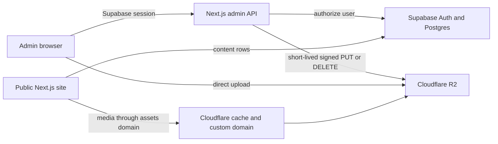

# FastService storage recovery and R2 migration

**Status:** Production cutover complete; final admin activation and custom media domain pending
**Date:** 2026-08-12
**Owners:** FastService / engineering

## Problem and user outcome

FastService production lost access to its Supabase-backed admin content and media after exceeding the Supabase file Storage quota. The public site remains available only because application-owned seed content is used as a continuity fallback; the content entered through the admin panel is not currently available.

The desired outcome is to recover the authoritative content and media, restore the admin panel, and prevent recurrence by keeping relational content and authentication in Supabase while serving media from Cloudflare R2.

## Current-state evidence

- Vercel runtime errors recorded `exceed_storage_size_quota` with HTTP 402 on 2026-08-05 and 2026-08-06.
- From 2026-08-07 onward, the Supabase hostname configured in production returns DNS `ENOTFOUND`.
- The Supabase connector available in this workspace does not have permission to inspect the historical FastService project, but the user-authorized Chrome session does.
- Supabase Studio confirms that all data remains safe and the project can be resumed until 2027-09-11.
- Studio reports 964 MB of file Storage against the Free-plan 1 GB allowance and approximately 0 GB of database size.
- The downloaded Storage export contains 267 objects and 1,378,325,193 uncompressed bytes. It passed ZIP integrity validation.
- The downloaded database export is gzipped plain SQL and contains 52 `content_items` rows and 267 `storage.objects` rows.
- CMS payloads reference 225 unique Storage keys. Of the exported objects, 223 are referenced, 44 are orphan candidates totaling 193,106,940 bytes, and 2 referenced JPG keys are absent from the export.
- Original JPGs dominate usage: 237 JPG files total 1,264,447,894 bytes. Forty-seven objects exceed 10 MiB and account for 729,659,505 bytes.
- The referenced-media optimization pass produced 223 R2-ready objects totaling 166,728,752 bytes, down from 1,185,218,253 bytes (about 85.9% smaller), with 2 source-missing references recorded in the manifest.
- A healthy replacement Supabase project now runs in the clean organization in `eu-west-1`. The reviewed schema/RLS migration and all 52 application-owned CMS rows were applied and count-verified. Historical Auth users and the compromised bootstrap credential were intentionally not imported.
- Cloudflare R2 is active with an EU-jurisdiction Standard bucket. All 223 optimized objects (166,728,752 bytes) were uploaded and list-verified with zero errors. CMS payloads now contain no old Supabase Storage origin or either missing source key; the missing boat gallery entry was removed and the missing water-taxi option image uses its valid service image fallback.
- Application commit `26b3a354221831c1859dffd8e2693029acce38c0` is deployed to production and all FastService aliases are active. Representative localized routes return HTTP 200, anonymous upload signing returns HTTP 401, and Vercel reported no runtime errors after the smoke requests.
- An explicitly authorized Resume attempt returned the project to the paused state. Organization Billing confirms an active Fair Use restriction for `Storage Size Exceeded`; immediate service restoration requires upgrading the plan, while the alternative is to wait for the next billing period or restore into a different active hosted project.
- The application stores structured CMS rows in `public.content_items` and media in the public `fastservice-gallery` Storage bucket.
- `app/admin/storage/sign-upload/route.ts` currently signs uploads against Supabase Storage.
- `components/admin/AdminDashboard.tsx` uploads original images without resizing, compression, or an image byte limit. Videos allow up to 200 MB.
- Uploads happen immediately, before the CMS snapshot is published, which can leave unreferenced objects when an edit is abandoned.
- `supabase/create-admin.sql` contains a fixed bootstrap identity and password. A matching class of credential was also shared in the supplied conversation, so it must be treated as compromised.
- The public application is deployed from Git commit `3308fd0655e97c49e951dd1c5f011998397aed5f` and responds successfully using local fallback content.

## Recovery gate

The source-access gate was satisfied on 2026-08-12 through the user's authenticated Chrome session. Both required exports were downloaded and their archive formats were inspected without executing recovered SQL:

1. `C:/Users/Maxim/Downloads/db_cluster-06-08-2026@16-46-55.backup.gz`
2. `C:/Users/Maxim/Downloads/srmdwudjynqovzoejcay.storage.zip`

The original archives are read-only recovery sources. Their full SHA-256 hashes were calculated locally and must be carried into the migration manifest before any extraction or transformation.

Secrets, access keys, database passwords, and downloaded customer data must not be committed or pasted into documentation.

## Goals

- Preserve every recoverable `content_items` row and referenced media object.
- Restore a hosted Supabase project for Postgres, Auth, RLS, and admin sessions.
- Move image and video objects to a Cloudflare R2 Standard bucket.
- Serve production media through a Cloudflare custom domain, not `r2.dev`.
- Keep admin uploads direct-to-object-storage through short-lived, server-authorized signed requests.
- Prevent oversized images, uncontrolled video growth, and silent orphan accumulation.
- Rotate the exposed admin credential and revoke old sessions before restoring admin access.
- Keep the public site available throughout migration.

## Non-goals

- R2 will not replace Postgres, Supabase Auth, or RLS.
- This change will not redesign the CMS content model.
- The conversion-oriented home-page redesign discussed with Dani is a separate delivery slice. The current code already includes a scrollable home, featured boats, editable price labels, and WhatsApp availability CTAs; recovered admin content must be reconciled before further visual iteration.
- No production mutation, paid-plan change, bucket creation, DNS update, credential rotation, or deployment occurs without explicit authorization for that action and target.

## Target architecture

R2 object keys remain stable and are stored in CMS payloads as `storagePath`. Public URLs are derived from the configured public media origin. Provider-specific secrets stay server-side.

## Functional requirements

### Recovery inventory

- Export the full database backup and all Storage objects before deleting or changing the old project.
- Record object count and total bytes per bucket.
- Extract every media `src` and `storagePath` referenced by `content_items`.
- Produce a manifest with source key, byte size, checksum when available, destination key, and migration status.
- Classify objects as referenced, shared, or orphaned. Do not delete orphans during the first migration pass.

### Database restore

- Restore the database to a hosted Supabase project using the official backup workflow.
- Reconcile schema, extensions, Auth configuration, RLS, Storage metadata, and environment variables.
- Keep `content_items` authoritative for admin reads.
- Validate public reads and denied unauthorized writes.

### R2 media migration

- Use R2 Standard storage initially.
- Preserve source object keys unless a collision or invalid key requires a documented mapping.
- Verify migrated object count, total bytes, and representative checksums before switching URLs.
- Rewrite CMS media origins in a controlled, reversible migration while preserving `storagePath`.
- Keep the source export untouched until post-cutover verification is complete.

### Uploads and deletion

- Only an authenticated user present in `admin_users` may request upload or delete authorization.
- Accept explicit MIME allowlists; do not trust file extensions alone.
- Images must be resized/compressed before upload and subject to a server-enforced byte limit.
- Videos must have a configurable byte limit substantially below the R2 single-object maximum and suitable for the operating budget.
- Signed uploads must expire quickly, use non-guessable keys, and never expose R2 secret credentials to the browser.
- Deletion must be performed through an authenticated server route and return a verifiable result.
- Failed or abandoned uploads must be discoverable by an orphan-report job; automatic deletion requires a separate retention decision.

### Public delivery

- Configure an R2 custom domain such as `assets.fastservicesibiza.com`.
- Add only that hostname to Next.js image configuration.
- Set immutable cache headers for UUID-based keys.
- Keep `r2.dev` disabled for production delivery.

### Security remediation

- Remove fixed credentials from `supabase/create-admin.sql` and Git-tracked documentation.
- Create the replacement admin through Supabase Auth using a unique password supplied directly by the owner.
- Register the new user in `admin_users` without embedding the password in SQL.
- Revoke existing sessions and rotate the exposed password after explicit authorization.
- Review Git history exposure and decide whether history rewriting is warranted; do not rewrite history by default.

## Non-functional requirements

- No Docker-dependent Supabase workflow.
- No secrets in Git, logs, generated manifests, SDDs, or memory.
- Migration is resumable and idempotent.
- Every destructive step has a retained backup and explicit approval.
- Public fallback remains operational until DB and media checks pass.
- Media URLs must remain HTTPS and accessible from desktop and mobile clients.

## Compatibility and rollout

1. **Acquire and freeze:** obtain source access/export; stop new admin uploads if the old project becomes reachable.
2. **Inventory:** inspect database and Storage usage; generate recovery manifests.
3. **Restore database:** restore to hosted Supabase; validate Auth, RLS, and CMS reads without changing production.
4. **Provision R2:** after billing confirmation, create Standard bucket, least-privilege API token, and custom media domain.
5. **Migrate media:** copy objects, verify counts/bytes/checksums, and retain the original export.
6. **Application support:** add R2 signing/deletion provider, upload limits, image optimization, and configuration documentation.
7. **Preview:** point a preview deployment to the restored database and R2 domain; verify authorized and denied paths.
8. **Cutover:** update production environment variables and deploy only with explicit authorization.
9. **Observe:** monitor 404s, upload failures, authentication failures, and R2 operations for at least 48 hours.
10. **Retire:** remove old objects only after written approval and successful retention-window review.

## Rollback

- Application rollback: restore the previous Vercel deployment and environment values.
- Content rollback: restore the pre-rewrite `content_items` backup.
- Media rollback: switch the configured public media origin back to the retained source export or restored Supabase bucket.
- Never delete the source backup as part of cutover.

## Acceptance criteria

- Database backup and Storage export exist in a secure location and have recorded sizes.
- Restored Supabase project is `ACTIVE_HEALTHY` and migration status is reconciled.
- Public content returns the recovered admin-authored boats and other records, not only seeds.
- Authorized admin login, content save, image upload, image delete, and logout succeed.
- Anonymous users cannot write content or media.
- All referenced media returns HTTP 200 from the production custom R2 domain.
- Migrated object count and bytes match the recovery manifest; any exceptions are documented.
- New images are size-controlled and optimized before storage.
- The fixed credential is absent from the working tree, the live password is rotated, and old sessions are revoked.
- `npm run lint` and `npm run build` pass.
- Representative desktop and mobile public/admin smoke checks pass.

## Test strategy

- Unit-test key normalization, MIME/size validation, public URL derivation, and manifest rewrite logic.
- Test upload authorization as anonymous, authenticated non-admin, and admin.
- Test allowed and denied content writes under RLS.
- Test image and video boundary sizes and unsupported MIME types.
- Compare pre/post migration content IDs, object keys, counts, total bytes, and sample hashes.
- Crawl recovered public routes and report broken media URLs.

## Risks

- The historical project may belong to a different Supabase account and remain inaccessible without Dani or another owner.
- A database backup does not by itself contain the Storage object bodies; both exports are required.
- Public HTML fallback proves availability but not recovery of admin-authored data.
- The exposed admin credential may already have been used by an unauthorized party.
- A URL-only rewrite without object verification would create widespread broken images.
- R2 has no egress fee, but storage and request operations can still incur charges.

## Decision log

- **2026-08-12:** Treat the incident as Supabase file Storage quota exhaustion, based on the exact production error, rather than assuming Postgres consumed several GB.
- **2026-08-12:** Keep Supabase for relational data/Auth/RLS and use R2 only for media objects.
- **2026-08-12:** Require a custom R2 domain for production; `r2.dev` is development-only.
- **2026-08-12:** Block recovery execution until source-project access or complete exports are available.
- **2026-08-12:** Source gate satisfied: downloaded database and Storage exports passed format/integrity checks; no production mutation was performed.
- **2026-08-12:** Do not migrate all 267 objects blindly. Preserve the source archive, migrate the 223 verified referenced objects, investigate 2 missing referenced keys, and retain the 44 orphan candidates until deletion is separately authorized.
- **2026-08-12:** Authorized resume attempt was blocked by the organization-level Storage quota restriction. Do not retry blindly; choose between a paid temporary upgrade and a replacement hosted project before continuing.
- **2026-08-12:** Created a replacement Free project in the old organization, but it inherited the Fair Use restriction and is unhealthy. Created a clean organization, where project creation is blocked because the account already has two active Free projects. Do not touch the unrelated SomosCamper project.
- **2026-08-12:** R2 application integration uses authenticated five-minute presigned PUT URLs, post-upload HEAD verification with deletion on type/size mismatch, server-side deletion, browser image optimization to WebP up to 2560 px, an 8 MiB image limit, and a 100 MiB video limit.
- **2026-08-12:** After explicit approval, deleted only the empty unhealthy replacement project to release the Free slot. Created healthy project `eilipheaulofoxgndiqf` in the clean organization and restored all 52 CMS rows; SomosCamper and the paused source project remain untouched.
- **2026-08-12:** Activated R2 and migrated 223 optimized objects. Use the temporary public `r2.dev` origin for immediate recovery, with immutable object caching and origin-restricted CORS; replace it with a custom media domain when the FastService DNS zone is available in Cloudflare.
- **2026-08-12:** The first post-cutover smoke revealed that Vercel still held the old Supabase publishable key, so public routes fell back to local seed content. Correct the key and canonical `NEXT_PUBLIC_SITE_URL`, redeploy, and verify recovered R2-backed content before closing the incident.
